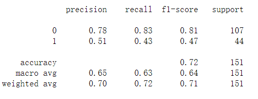
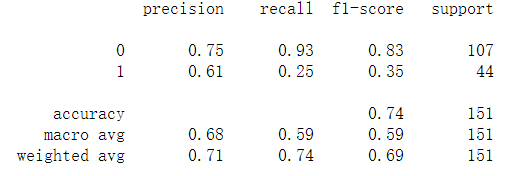
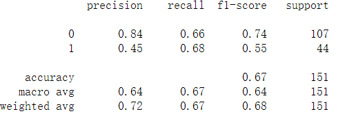
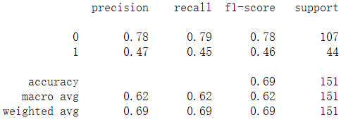
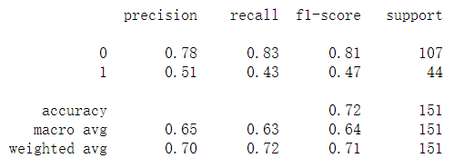
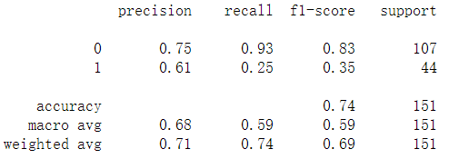
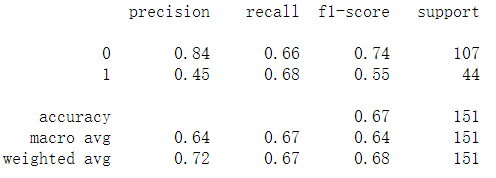
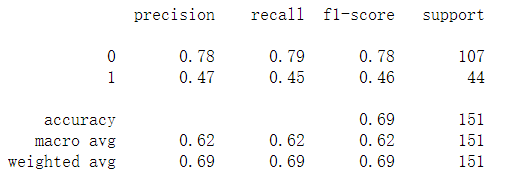

## Purpose
Nowadays, people are busy with their jobs and studies. More and more people didn't wanna waste of their time to try out the new restaurant. Instead, people like to use app like yelp to help them find the restaurant. We would like to use python to analysis the review from yelp to see the 'power' of a comment. 

By using web-crawler based on requests, we'll get data from yelp review and focused on specific word in each review to predict the score. In the end, the program will create a rating classifier for yelp reviews.
## Dependencies
- pandas
- numpy
- requests
- json
- sklearn
- matplotlib
## Collecting data
Yelp is one of the most popular app in food searching. Gourmets would post their reviews for the restaurant they visited. However, Yelp didn't provide any API to download the reviews. What we are gonna do is to collect the data from yelp. We will create a web-crawler by using requests to collect the data. We choose a random restaurant on Yelp as the example data set to show in the following paragraph.
## Data cleaning
Reviewer can rate the restaurant from 1 to 5 stars. It might be hard for the data-science beginner like me to predict multiple outcome.So, I will change the  We are gonna mark the rate that below or equal to 3 as the bad review and the rate greater than 3 as the good review.
## Analyze the sentence
The power of a word is decent. By using countervectorize in sklearn, we could split the sentence into bag of words. The bad of words could let us know which words are stand for good review and which words stand for bad reviews. 

## Model fitting
### Model choosing
We will try different type of models to see their performance in predicting. 
- Logistic Regression

  
- SVM

  
- Decision_Tree

  
- LightGBM

  

Or we can try TF-IDF instead of bag of words
- Logistic Regression

  
- SVM

  
- Decision_Tree

  
- LightGBM

  

## Results
By using the different models in either bag-of-words or TF-IDF, we will get differernt results. We can see that xxxx has the best performance in bag-of-words and xxxx has the best performance in TF-IDF.
